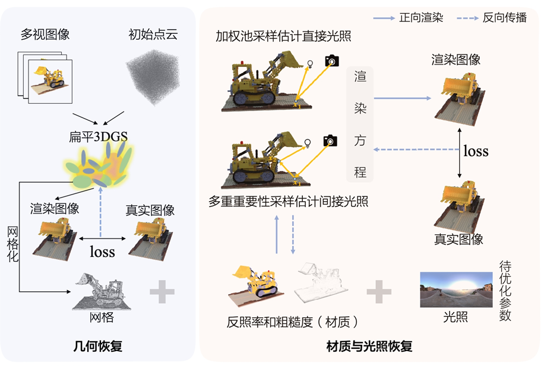

# A-Fast-Physically-Based-Inverse-Rendering-Framework
A Fast Physically-Based Inverse Rendering Framework Fusing 3D Gaussian Splatting Geometry Enhancement and Efficient Material Encoding



# Acknowledgement
Our code is based on the following work：

GOF https://github.com/autonomousvision/gaussian-opacity-fields?tab=readme-ov-file

PGSR https://github.com/zju3dv/PGSR?tab=readme-ov-file

2DGS https://github.com/hbb1/2d-gaussian-splatting

TensoIR https://github.com/Haian-Jin/TensoIR?tab=readme-ov-file

MIRReS https://github.com/brabbitdousha/MIRReS-ReSTIR_Nerf_mesh?tab=readme-ov-file

# Install
```
git clone https://github.com/YAO-mm/A-Fast-Physically-Based-Inverse-Rendering-Framework.git

cd FIRF

conda create -n FIRF
conda activate FIRF

# Get right pytorch and cuda version. Our settings: pytorch:2.2.0, cuda:12.1
pip install -r requirements.txt
pip install submodules/diff-plane-rasterization
pip install submodules/simple-knn
pip install git+https://github.com/NVlabs/tiny-cuda-nn/#subdirectory=bindings/torch
pip install git+https://github.com/NVlabs/nvdiffrast/

```
# Dataset
Download the TensoIR dataset from official website https://github.com/Haian-Jin/TensoIR?tab=readme-ov-file.

```
data
├── tensoir_syn
│   ├── armadillo
│   │   ├── test_000
│   │   │   ├── albedo.png
│   │   │   ├── diffuse-color.exr
│   │   │   ├── metadata.json
│   │   │   ├── ...
├── dtu_dataset
│   ├── dtu
│   │   ├── scan24
│   │   │   ├── images
│   │   │   ├── mask
│   │   │   ├── sparse
│   │   │   ├── cameras_sphere.npz
│   │   │   └── cameras.npz
│   ├── dtu_eval
│   │   ├── Points
│   │   │   └── stl
│   │   └── ObsMask
```

# Usage
##  preprocess the dataset
python scripts/preprocess/convert.py --data/tensoir

## step 1
python train.py -s data/tensoir -m out_path --max_abs_split_points 0 --opacity_cull_threshold 0.05

python render.py -m out_path --max_depth 10.0 --voxel_size 0.01

## step 2
python main.py data/tensoir_syn/tensoir_train/tensoir_lego --workspace ir_lego/ -O --bound 1 --scale 0.8 --dt_gamma 0 --stage 0 --lambda_tv 1e-8 --iters 50000

python main.py data/tensoir_syn/tensoir_train/tensoir_lego --workspace ir_lego/ -O --bound 1 --scale 0.8 --dt_gamma 0 --stage 1 --use_brdf --use_restir --lambda_kd 0.017 --lambda_ks 0.0001 --lambda_normal 0.0001 --lambda_edgelen 0.1 --lambda_nrm 0.00035 --lambda_rgb_brdf 0.05 --lambda_brdf_diffuse 0.002 --lambda_brdf_specular 0.00003

## evaluate
python main.py data/tensoir_syn/tensoir_train/tensoir_lego --workspace ir_lego/ -O --bound 1 --scale 0.8 --dt_gamma 0 --stage 1 --use_brdf --use_restir --test --test_no_mesh --spp 512


